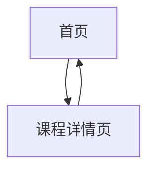

## 1. Product Overview
许小烁的个人主页，展示广东科学技术学院商学院商务数据分析与应用专业的课程信息。
- 主要用途：个人学术展示，课程介绍，准备部署到 Cloudflare Pages
- 目标：创建一个简洁美观的纯静态个人页面

## 2. Core Features

### 2.1 User Roles
| Role | Registration Method | Core Permissions |
|------|---------------------|------------------|
| 访客 | 无需注册 | 浏览所有页面和课程信息 |

### 2.2 Feature Module
1. **首页**: 个人介绍，导航栏，课程列表
2. **课程详情页**: 各个课程的详细信息页面

### 2.3 Page Details
| Page Name | Module Name | Feature description |
|-----------|-------------|---------------------|
| 首页 | Hero 区域 | 展示个人姓名、学校、专业信息 |
| 首页 | 导航栏 | 页面间导航 |
| 首页 | 课程卡片 | 展示多个课程的概览信息 |
| 课程详情页 | 课程内容 | 展示课程详细信息（预留补充空间） |

## 3. Core Process
访客访问首页 → 浏览个人信息和课程列表 → 点击课程卡片进入课程详情页

## 4. User Interface Design
### 4.1 Design Style
- 主色调：深蓝色（代表专业和学术）和白色（简洁干净）
- 按钮风格：圆角按钮，带有微妙的悬停效果
- 字体：使用现代无衬线字体，标题使用稍粗的字体，正文使用常规字体
- 布局风格：卡片式布局，响应式设计
- 图标风格：简洁的线性图标

### 4.2 Page Design Overview
| Page Name | Module Name | UI Elements |
|-----------|-------------|-------------|
| 首页 | Hero 区域 | 渐变色背景，大标题，副标题，简洁的排版 |
| 首页 | 课程卡片 | 网格布局，每个卡片包含课程名称和简短描述 |
| 课程详情页 | 内容区域 | 清晰的内容结构，预留文本区域 |

### 4.3 Responsiveness
采用移动优先设计，自适应从移动设备到桌面设备的各种屏幕尺寸

### 4.4 3D Scene Guidance
本项目不包含 3D 场景
